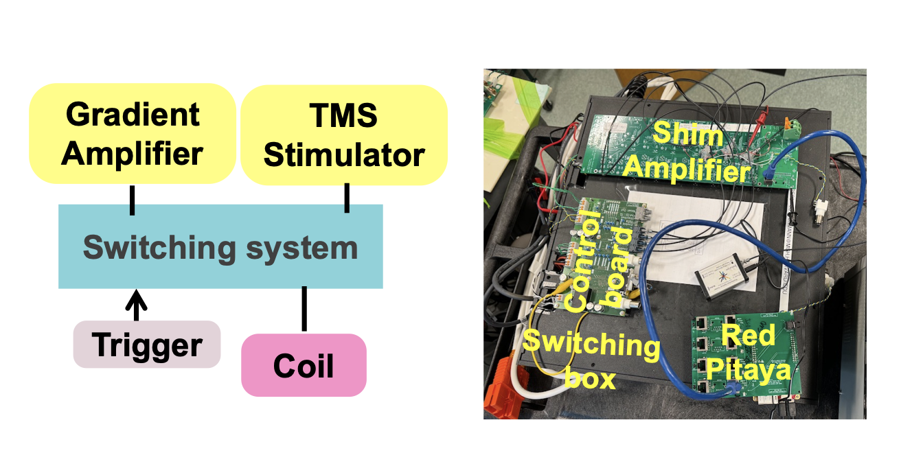
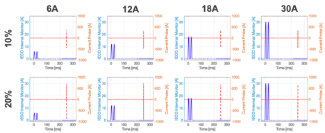
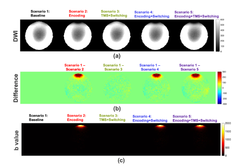

## Overview

We developed a switching and control system that allows the use of one
coil for operation in both TMS and MRI modes. A switching box toggles
between the two operation modes and the control system monitors the
safety and transmits switching commands to the box itself.

## Design

Two DCNEVT400 contactors (1.8kV, 400A) and two AEVT500 contactors
(1.8kV, 3.3kA) are inside the switching box to switch in and out from
MRI and TMS modes.

The Red Pitaya (FPGA, TEMLabs) and host computer coordinate operation
mode transitions, MRI encoding sequences, and TMS pulse triggering.

The system reads an external trigger and starts the pre-programmed
commands in the host computer. Through red pitaya, DAC, and control
board, the command is executed as (1) encoding sequences that can be
inputed into a gradient amplifier, (2) switching between different
operation mode that instructs which pairs of contactors should be
open/closed, and (3) TMS trigger that can be inputed into the TMS
stimulator as the "trigger in" for firing TMS pulse.

Five fault conditions are actively monitored: (1) bad command, (2) TMS
stuck open, (3) TMS stuck closed, (4) GPA stuck open, and (5) GPA stuck
closed. Bad commands prevent unintended TMS pulses from being triggered
when the TMS contactors are not fully closed or when a nonzero gradient
amplifier current is detected during TMS mode. The TMS stuck open/closed
and GPA stuck open/closed mechanisms continuously monitor the actual
state of their respective contactors. If any fault condition is
detected, the fault LED is activated, all contactors are immediately
disengaged, and the system enters a safe shutdown state.

## Circuit Design/Specifications

The switch-box circuit design and related files require a current PI-managed
external download link.

## Control

The Red Pitaya, the heart of the control section, has an AMD/Xilinx
Zynq-7-series FPGA, which contains both programmable logic and a
microprocessor running a Linux operating system from an SD card. The
pulse timing sequence is represented by a CSV text file stored on the SD
card, with a column for each control signal, and the rows representing
the state of each signal at fixed 0.5 ms time steps. These control
signals are: - Enable (digital) - TMS or GPA mode (digital) - Fire TMS
pulse (digital) - GPA current setpoint (analog) Custom software running
on the Red Pitaya’s microprocessor reads this pulse sequence file, and
waits for an external trigger to run the sequence. When this external
trigger arrives, the software uses a SPI protocol interface in the
FPGA’s programmable logic to “re-play” the sequence of output signals on
the DAC board. The example playback script requires a current PI-managed
external download link.

## Tests and Results

Lab bench tests were conducted to validate whether the system will
safely switch between different TMS pulse strength and graident
amplifier power level. For that, we tested the system with TMS strength
of 10% and 20% combined with graident waveform current pk-pk of 6A, 12A,
18A, 30A. Scanner tests were conducted to show if the system would
induce local diffusion weighting without introducing any complications.
We tested five scenarios inside a 3T scanner (SIEMENS MAGNETOM 3.0T):
Scenario 1. Scanner baseline, Scenario 2. Encoding only, Scenario 3.
TMS + Switching, Scenario 4. Encoding + Switching, and Scenario 5.
Encoding + TMS + Switching. Imaging was captured using a spherical water
phantom with the same spin echo EPI diffusion weighted sequence played
out by 3T scanner (TE:50ms, TR:20000ms, Voxel Size: 2.0×2.0×6.0 mm³, 20
slices).

