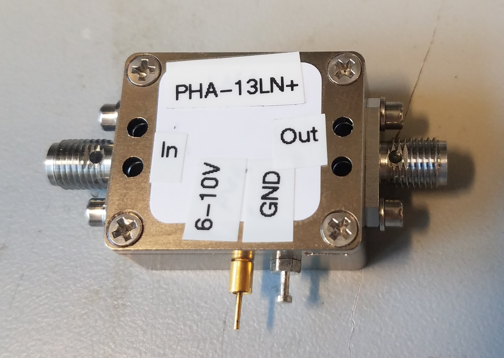
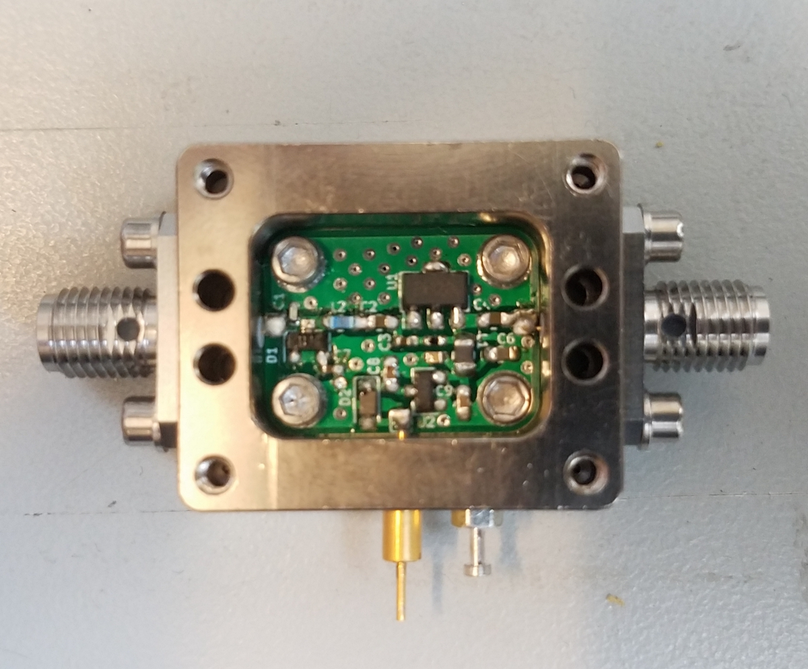
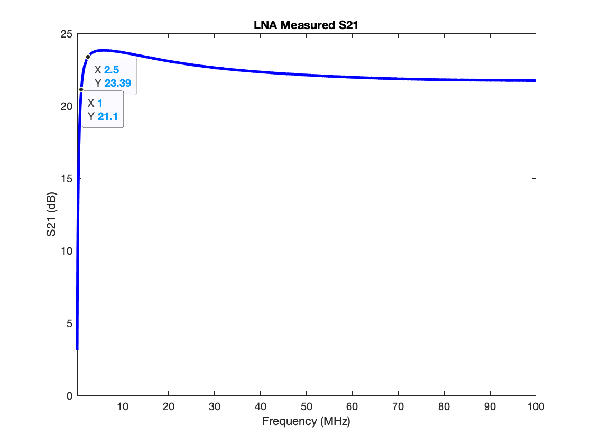
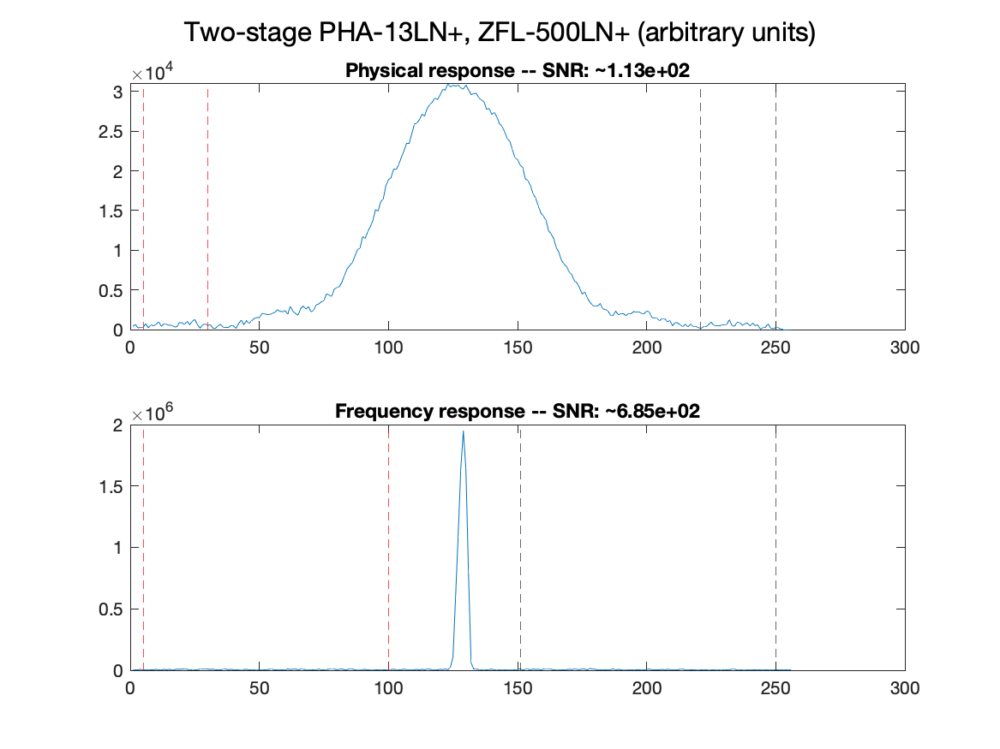

## Overview

A low-noise 50-ohm broadband amplifier for early gain stages that
functions at at a range or radio frequencies. Functions using the
PHA-13LN+ (see parts list at bottom).

Project contribution by Lincoln Craven-Brightman, Research Engineer in
the MR-PIGs group.

## Design

The LNA is housed inside a 0.75" X 0.5625" X 0.58" RF enclosure from
Lotus Communications Systems (see parts list at bottom). The enclosure
takes SMA input and output, and requires 6+ V DC with ~75 mA of
operating current. The enclosure is connected to the board and SMA GND.
The current model does not have impedance matching incorporated.

This layout is adapted from the PHA-13 datasheet from Mini Circuits.

## Specs

### Gain

The LNA demonstrates a gain of above 20 dB over 1-100 MHz. Gain slowly
falls off to 17 dB at 1 GHz, and drops sharply below 1 MHz.

### Safety limits

The enclosure is fitted with a crossed diode on the input to protect the
pre-amplifier. Preliminary testing showed the circuit survived 200 Watts
of transmit RF power (~5% duty cycle). With \>1 KW of power, the PHA-13
was damaged and had to be replaced. The other components inside the
enclosure survived.

### Testing

The LNA was tested on the Halbach table-top scanner (~3 MHz center
frequency) as a gain stage, along with the Minicircuits ZFL-500LN+
[1](https://www.minicircuits.com/WebStore/dashboard.html?model=ZFL-500LN%2B).
It demonstrated similar SNR to the lab's current AU-1583 amplifiers when
total gain was comparable, using different gain stages. The domain
chosen as "noise" is delimited by vertical dashed lines. All testing
data is included below.

## Files

The KiCAD files, parts list, and testing data require current PI-managed
external download links.
