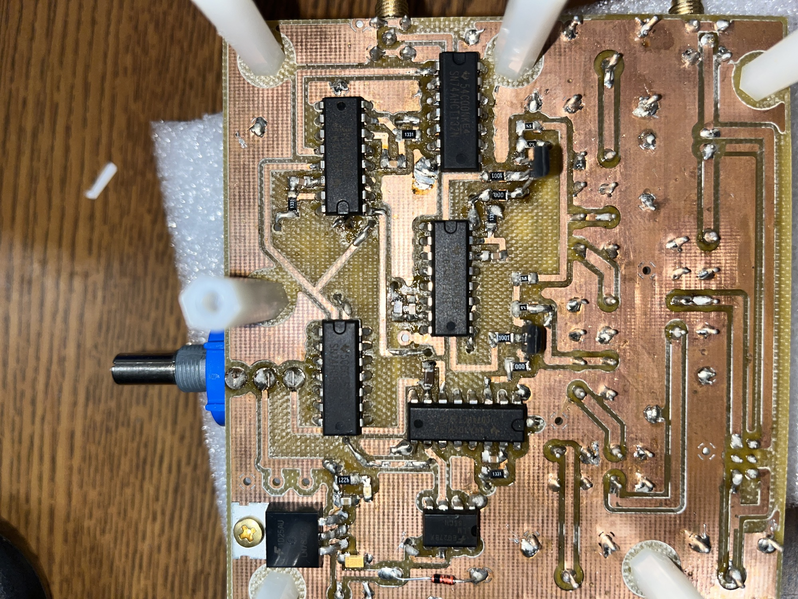

The PCB schematic and layout require a current PI-managed external download
link.

Large blue potentiometer sets TE. Smaller potentiometers are used to set
the duration of the gating pulse for 90 and 180 deg pulses (sent to
RFPA), duration of the 90 deg. excitation hard pulse, duration of the
180 deg. refocusing hard pulse, and TR.

The synthesizer input should typically be 10 dBm or higher to drive the
mixers properly.

